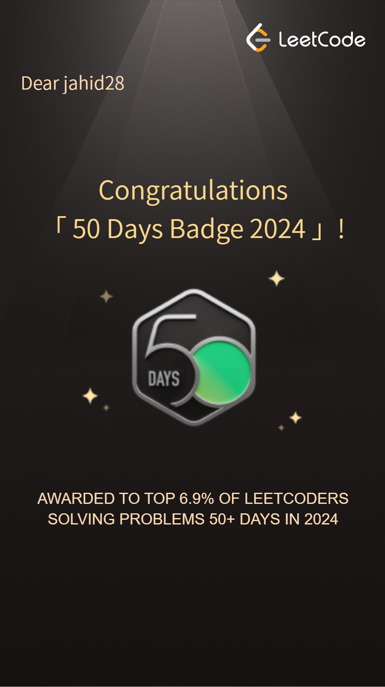

#Hello TWD
###How are you

Lets see some badges
<Frame width="auto" height="auto" >
  
</Frame>

**Click on [Google](https://www.google.com) to go to google**


```javascript
function greet() {
  console.log("Hello, world!");
}
```

---

```python
a=9
b=true
print("Hi")
```

> This is a blockquote.

| Header 1 | Header 2 |
| -------- | -------- |
| Cell 1   | Cell 2   |


\*This is not italic\*
